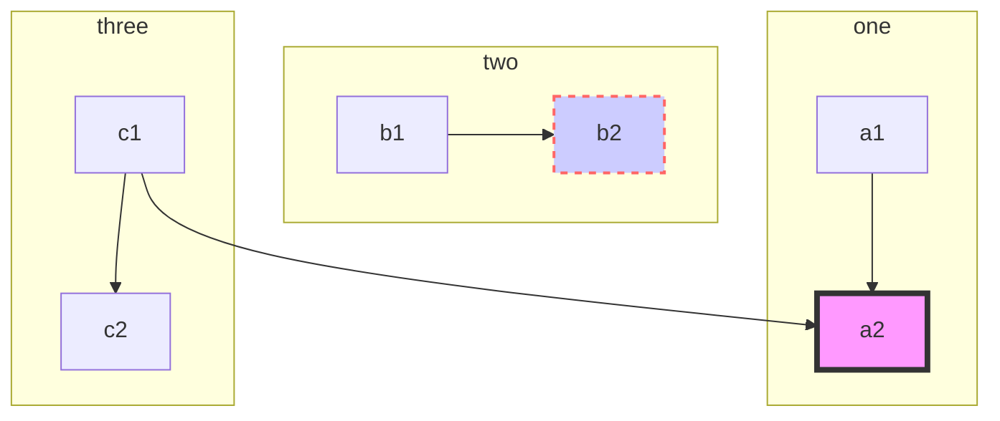
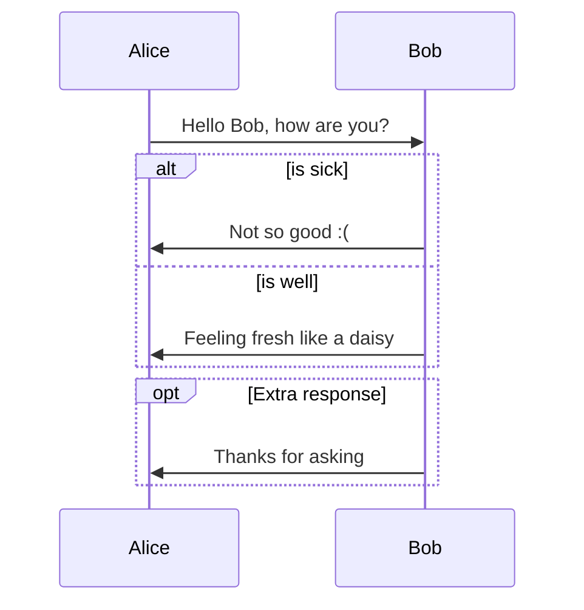
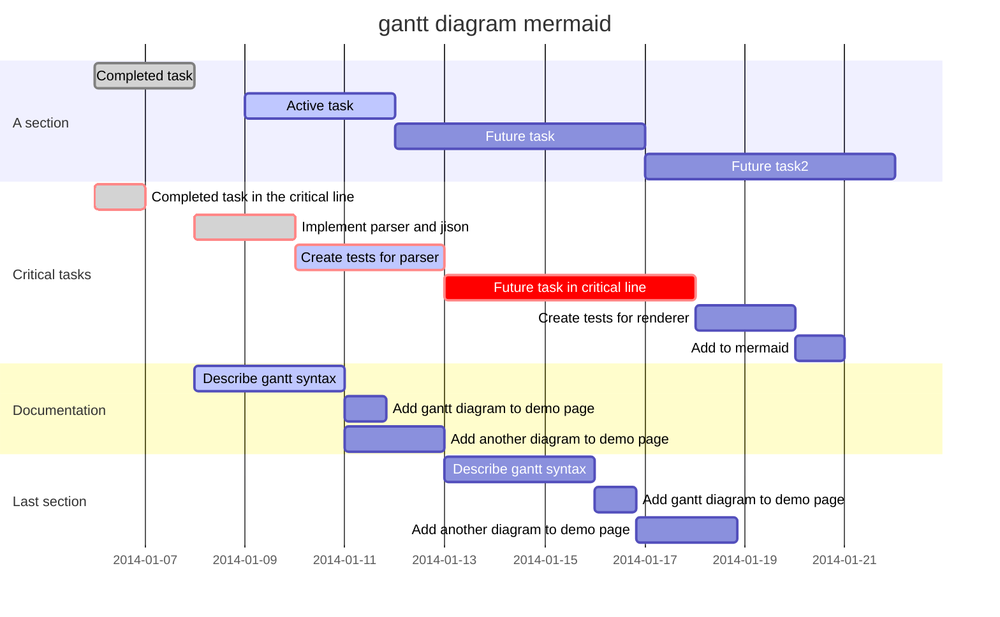

## MarkdownMaid 
Visual Studio Code Markdown Extension with mermaid
---

### Usage
command: MarkdownMaid

### thanks
* marked
* mermaid

## Features
---
### subgraph

---
### sequenceDiagram

---
### gantt

---
### Release Notes
* 0.1.0: preview markdown with mermaid